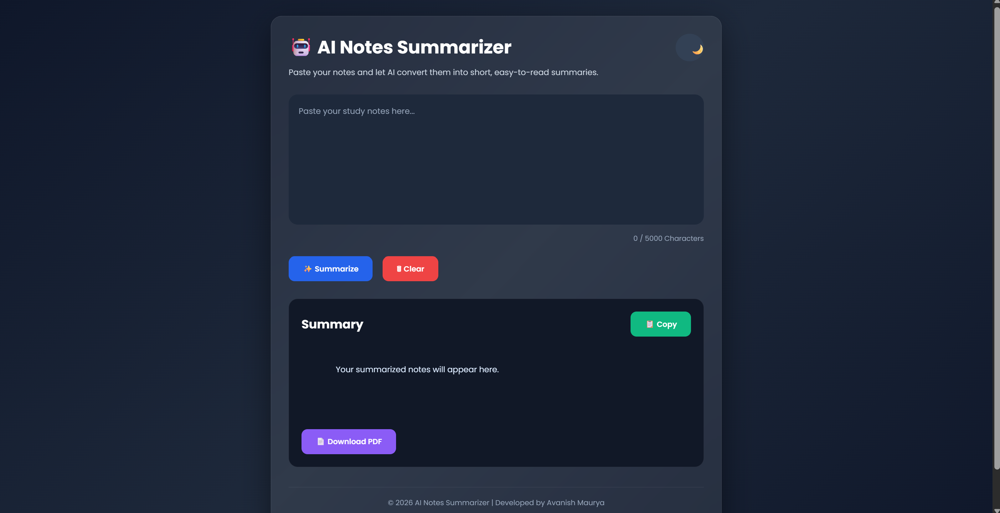
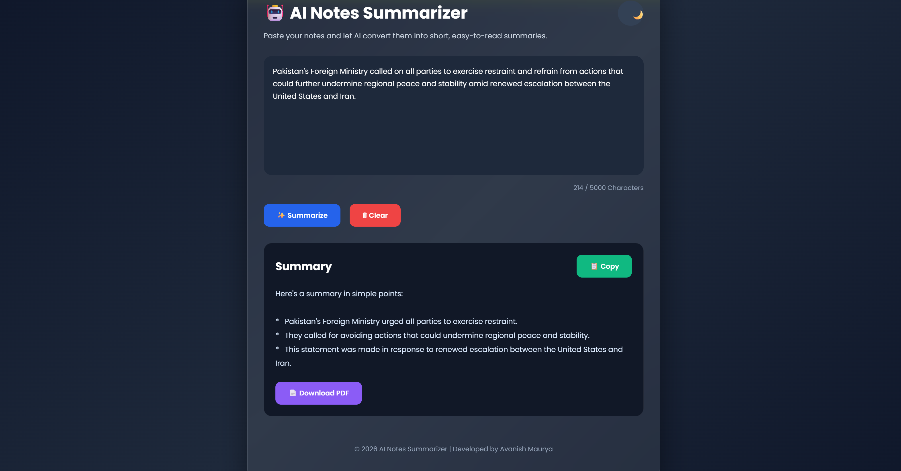

 # 🤖 AI Notes Summarizer

An AI-powered Notes Summarizer built using **HTML, CSS, JavaScript, Node.js, Express.js, and Google Gemini API**. It converts lengthy notes into short, easy-to-read summaries.

## 🚀 Features

- 📝 Paste long notes
- 🤖 AI-generated summaries
- 📋 One-click copy summary
- 🧹 Clear notes instantly
- 📱 Responsive UI

## 🛠️ Tech Stack

- HTML5
- CSS3
- JavaScript
- Node.js
- Express.js
- Google Gemini API

## 📸 Screenshots

### Home Page



### Generated Summary



## ⚙️ Installation

```bash
git clone https://github.com/avanishmaurya1/AI-Notes-Summarizer.git

cd AI-Notes-Summarizer/Backend
npm install

# Create .env file
GEMINI_API_KEY=YOUR_API_KEY

npm start
```

Open `Frontend/index.html` in your browser.

## 🌐 Live Demo

**Frontend:**  https://ai-notes-summarizer-kappa.vercel.app/

**Backend:** https://ai-notes-summarizer-4b71.onrender.com

## 👨‍💻 Author

**Avanish Maurya**

- GitHub: https://github.com/avanishmaurya1
- LinkedIn: https://www.linkedin.com/in/avanishmaurya1/

⭐ If you like this project, don't forget to star the repository!